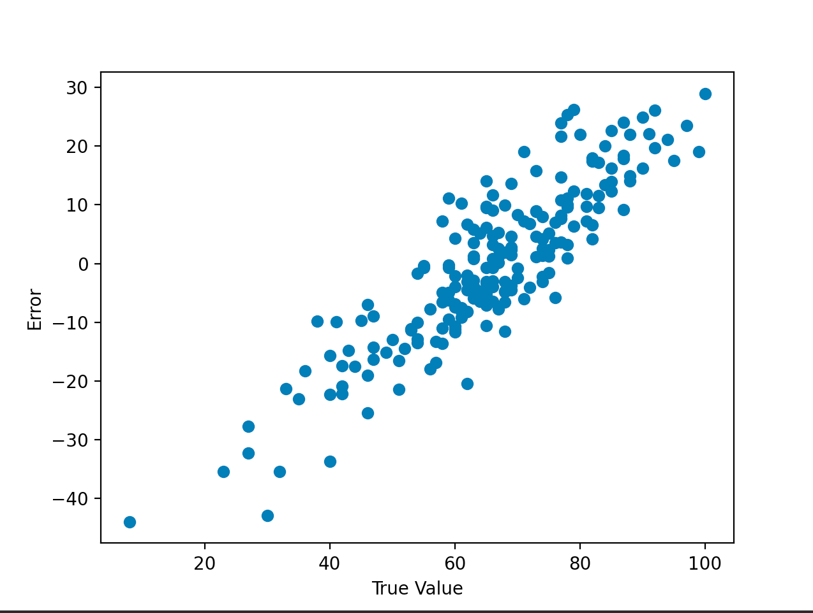
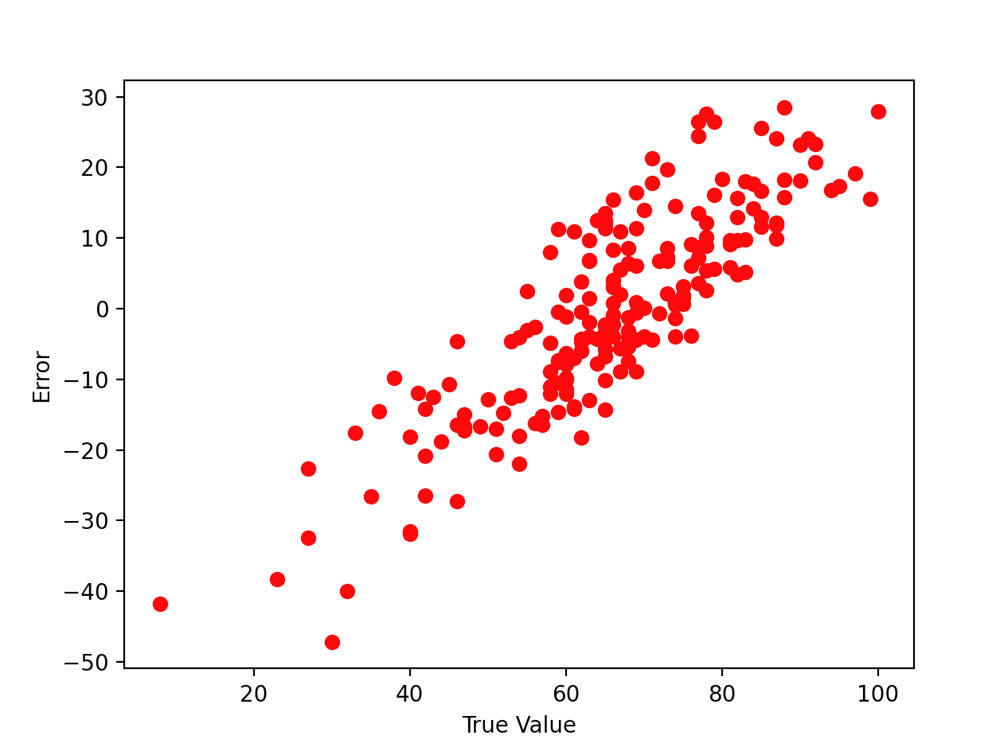

# students-performance-prediction
 
# About
&nbsp;Use various Regression models to predict the marks of students.
## DataSet:
The DataSet can be found [here](https://www.kaggle.com/datasets/spscientist/students-performance-in-exams).

There are 8 columns, put of which 5 are feature columns.

All the feature columns are categorical and hence are label encoded prior to fitting the model.

 There are three columns that tcan be used as target columms in the data set. Here only the *'maths score'* column has been predicted and the others have been dropped.

The results of various different models are discussed below:

## Linear:
&nbsp;Tried to fit the data in a Linear Regression model.

&nbsp;Large amount of error is seen:

## *R2 value comes out &rarr; **0.19308861560707336***

## Polynomial:
When the data was fit in a polynomial model, the results are worse than linear for higher degrees of the features. 

For degree=3, 

## *R2 value comes out &rarr; **0.11539991529590632***

